# Deep learning

Hierarchical learning algorithms with many 'layers', (very) loosely inspired by the brain

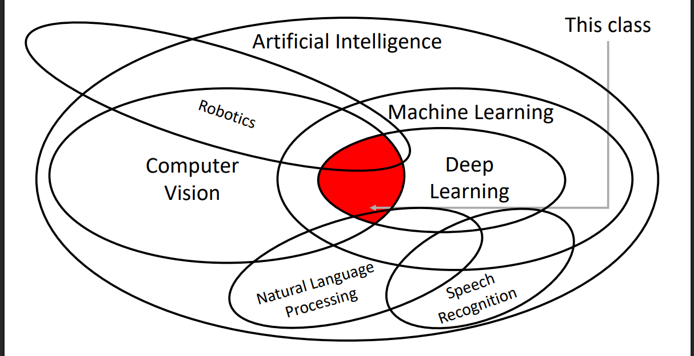

Deep learning goes mainstream with Alexnet 2012 made for the IMAGENET challenge


## Perceptron

One of the earliest algorithms that could learn from data
Implemented in hardware! Weights stored in potentiometers,
updated with electric motors during learning
Connected to a camera that used 20x20 cadmium sulfide
photocells to make a 400-pixel image
Could learn to recognize letters of the alphabet
Today we would recognize it as a linear classifier

## Backpropagation


## ML Approach

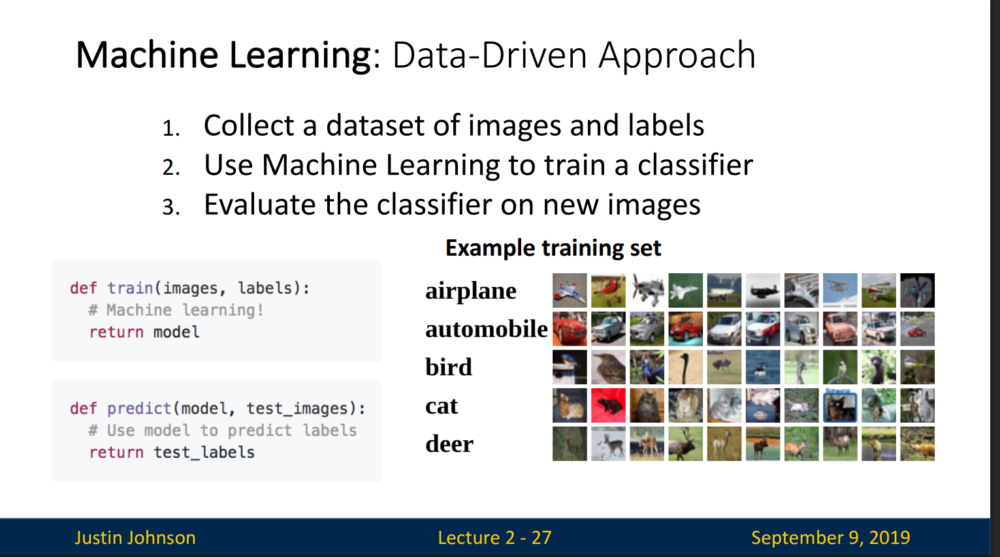

## Hyperparameters

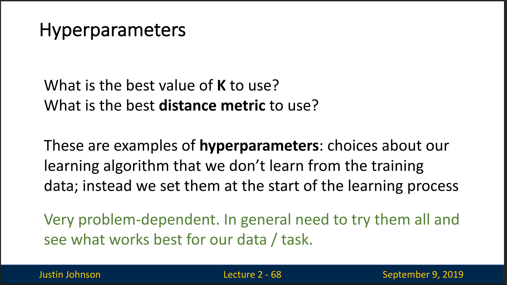

# Linear Classifier

## Intuition (Algebraic)

A linear classifier is usually written as: f(x)=w⋅x+b

Think of the weights as sliders that tell the model how important each feature is for the decision

The bias is like the baseline threshold or offset.

Without it, the decision boundary (the line or hyperplane) would always pass through the origin (0,0,...). But real problems don’t line up neatly like that.

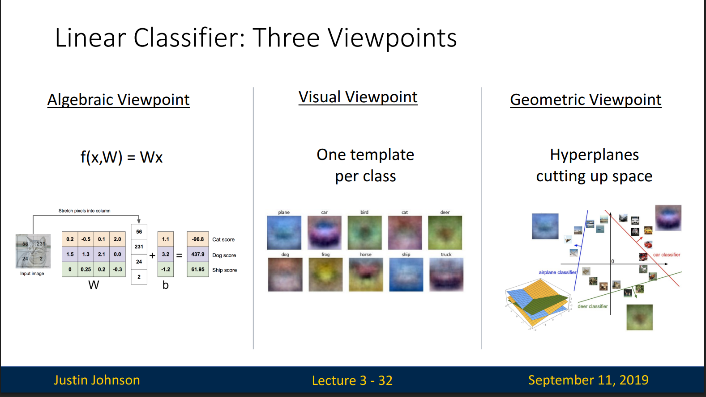

Algebraic Viewpoint = weights × pixels + bias → scores.

Visual Viewpoint = each class has a template; compare input against templates.

Geometric Viewpoint = classifiers create hyperplanes cutting the space into class regions.

## Choosing a good W

1. Use a loss function to quantify how good a value of W is
2. Find a W that minimizes the loss function (optimization)

## Loss Function

A loss function tells how good our current classifier is

Low loss = good classifier
High loss = bad classifier

(Also called: objective function;
cost function)

### Multi Class SVM loss

The score of the correct class should be higher than all the other scores.

The multiclass SVM loss for a single example is:

```math
L_i = \sum_{j \ne y_i} \max(0, s_j - s_{y_i} + 1)
```

Where:

- **\( L_i \)**: Loss for example \( i \)
- **\( x_i \)**: Input image
- **\( y_i \)**: True label (e.g., "dog")
- **\( s = f(x_i, W) \)**: Vector of scores for all classes
- **\( s\_{y_i} \)**: Score for the correct class (\( y_i \), e.g., dog's score)
- **\( s_j \)**: Score for some other class \( j \)
- The sum is over all classes \( j \) not equal to the correct class \( y_i \)
- The **margin** (here, 1) is a hyperparameter
- The loss increases if incorrect classes have scores close to or higher than the correct class

**SVM loss**: Make the correct class not just win, but win by a safe margin.

Formula = hinge loss: punish if wrong classes are too close.

Geometric meaning = push decision boundaries apart so classes are well separated.

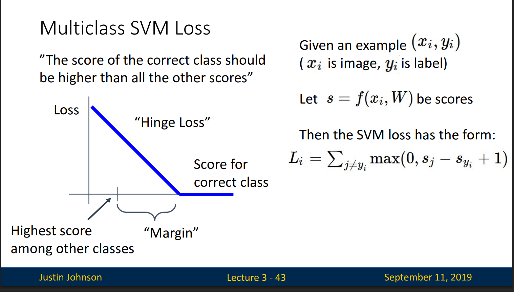

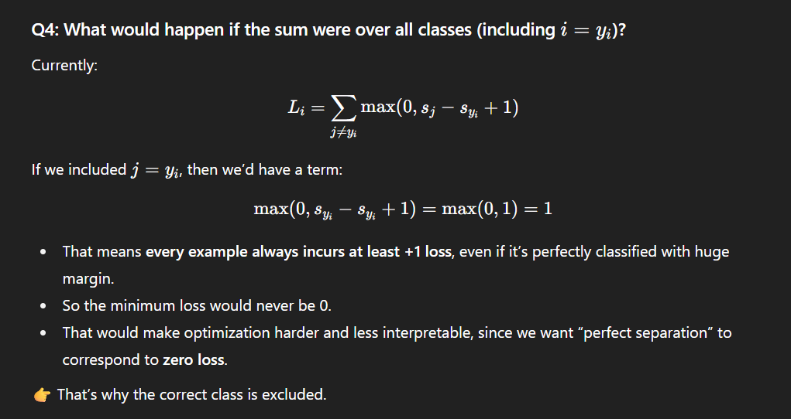

# Regularization

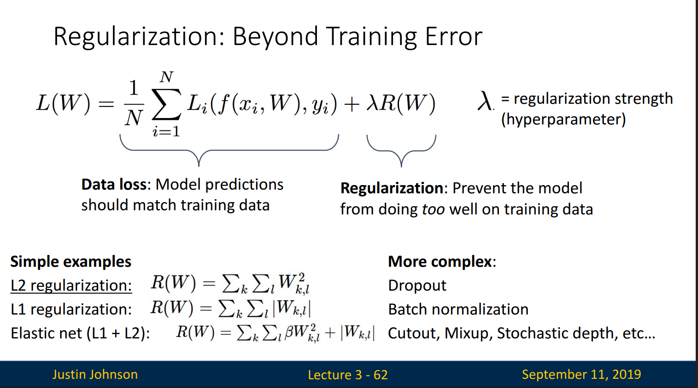

Avoid overfitting: Prefer simple models that generalize better

### Cross-Entropy Loss (Multinomial Logistic Regression)

Want to interpret raw classifier scores as probabilities


The network outputs raw scores (logits).

Softmax turns them into probabilities.

Cross-entropy compares the predicted probability of the true class against 1.

The loss is low if the model assigns high probability to the correct class, and high otherwise.

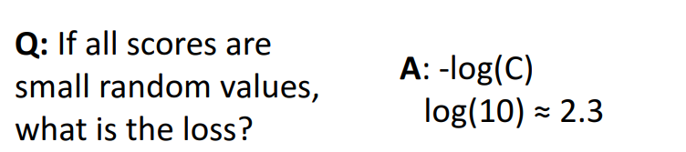

SVM Loss (hinge) only cares about the margin — as long as the correct class is “ahead by 1,” it’s happy. After that, no incentive to push further.

Cross-Entropy Loss always keeps pushing probabilities toward 1, never truly reaching 0 loss unless the probability is exactly 1 (which is impossible in finite scores).


# Optimization

The slope in any direction is the dot product of the direction with the gradient
The direction of steepest descent is the negative gradient

In practice we will compute dL/dW using backpropagation. (autograd , loss.backward()) - Lecture-6

Pytorch func'n to check gradient:

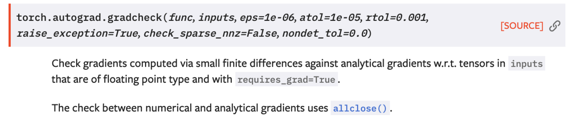

## Gradient Descent

Optimization algorithm to minimize a loss function

Iteratively step in the direction of the negative gradient (direction of local steepest descent)

Standard Gradient Descent computes the gradient using the entire dataset → very accurate but slow.
Stochastic Gradient Descent (SGD) instead uses one (or a small batch of) training example(s) at a time

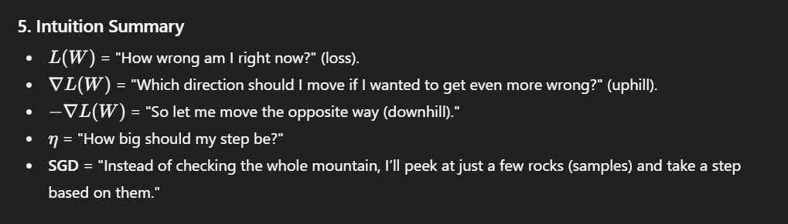

### If the loss changes fast in one direction and slow in another, vanilla SGD zig-zags and converges slowly.

### This is caused by a high condition number (elongated valleys).

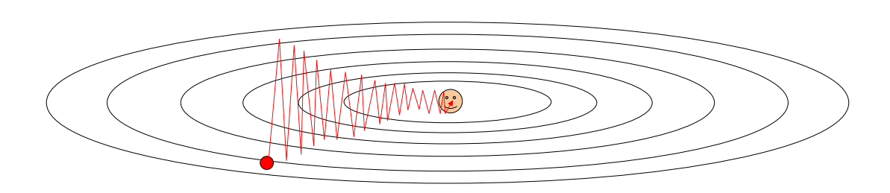

### Solutions = momentum, adaptive optimizers, normalization tricks.

What if the loss function has a local minimum or saddle point? - Zero gradient, gradient descent gets stuck

## SGD + momentum

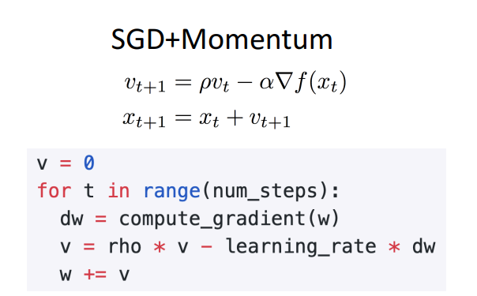

Think of rolling a ball:

Gradient = slope of the hill.

Momentum = ball’s velocity.

Friction = factor ρ (decay, so velocity doesn’t grow forever).

The ball speeds up when slopes keep pointing downhill in the same direction, but smooths out noise and oscillations.

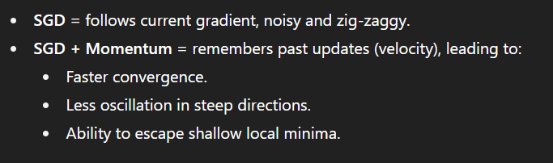

## AdaGrad

AdaGrad (Adaptive Gradient Algorithm) adapts the learning rate per parameter over time by scaling it according to how often that parameter has been updated.

If a parameter gets large gradients frequently → learning rate shrinks for it.

If a parameter rarely gets updates → learning rate stays relatively larger.

“Per-parameter learning rates” or “adaptive learning rates”

## RMSProp: “Leak Adagrad”

RMSProp says: “Instead of summing gradients forever, let’s keep an exponentially decaying average of past squared gradients.”
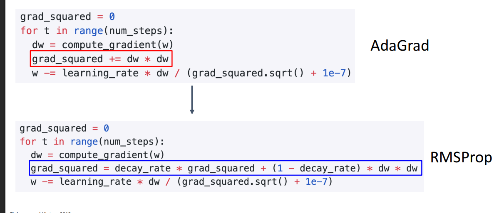

recent gradients matter more than old ones

Effect:

If gradients are large recently → learning rate shrinks

If gradients are small → learning rate grows

This balances step sizes across parameters → stable convergence.

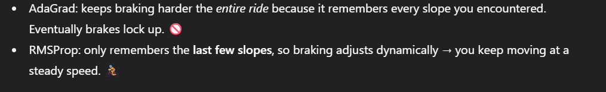

## ADAM ( RMSprop + Momentum)

Adam combines both ideas:

Momentum part (moment1) → Smooths the gradient, so you don’t overreact to noise.

RMSProp part (moment2) → Normalizes by the history of squared gradients, so you don’t step too far in steep directions.

Update = Smooth direction (momentum) ÷ Safe step size (RMSProp)

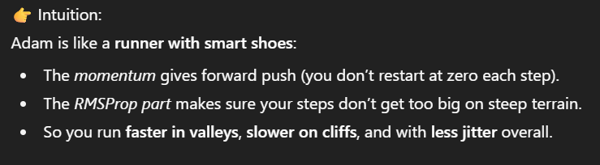

# Optimization Algorithm Comparison

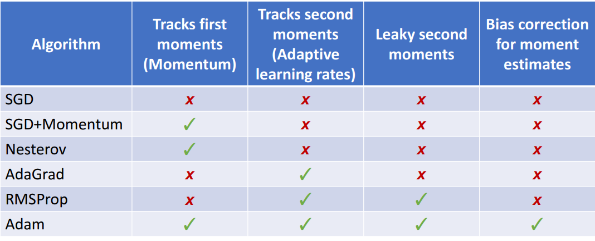

## Adam is a good default choice in many cases SGD+Momentum can outperform Adam but may require more tuning
