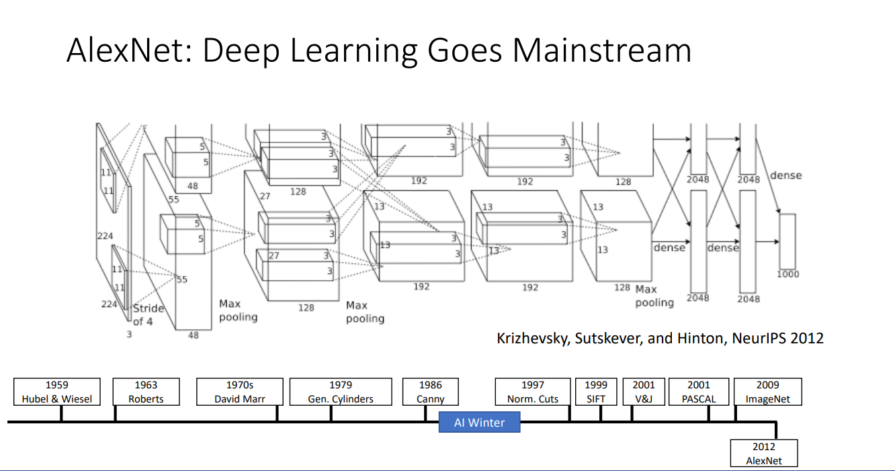
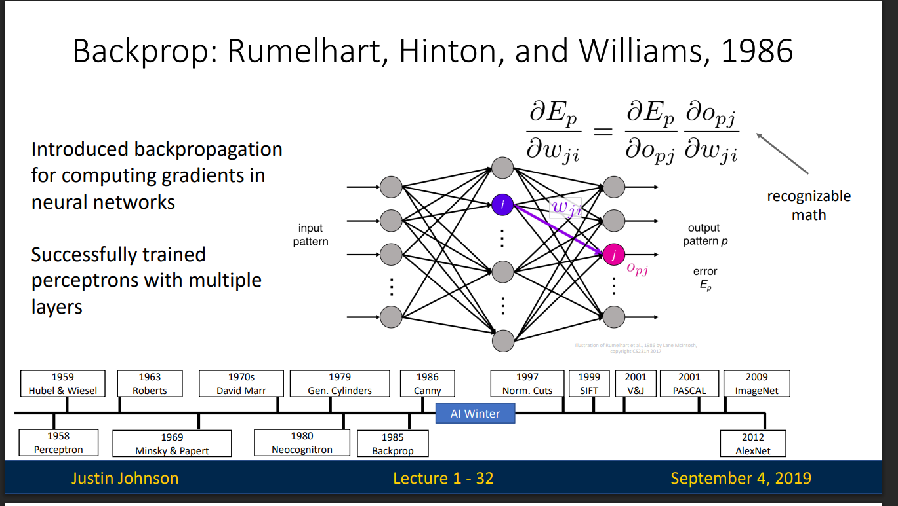
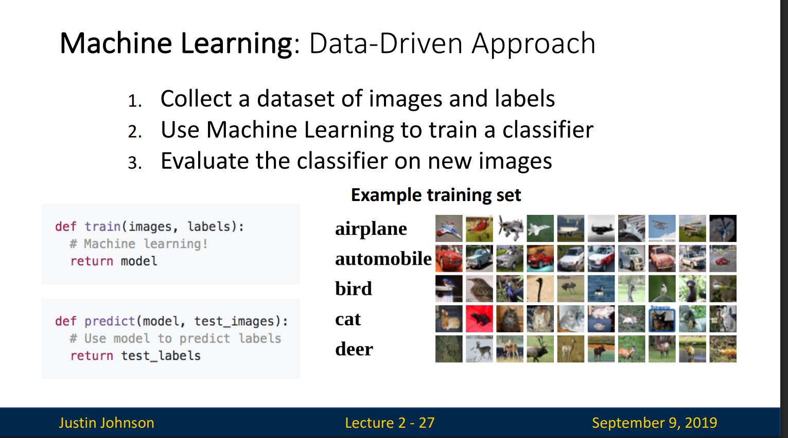
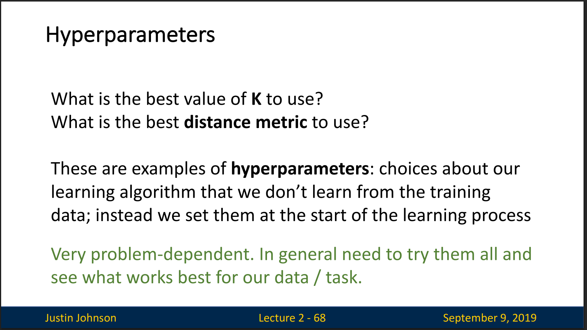
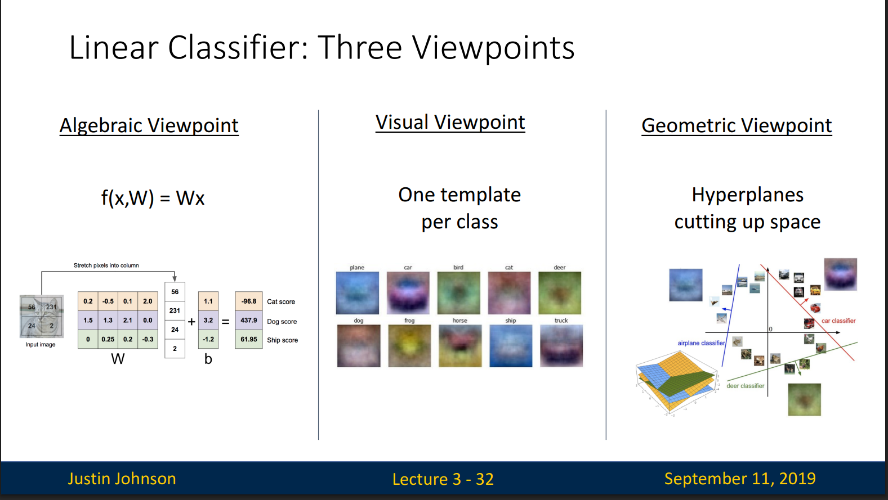
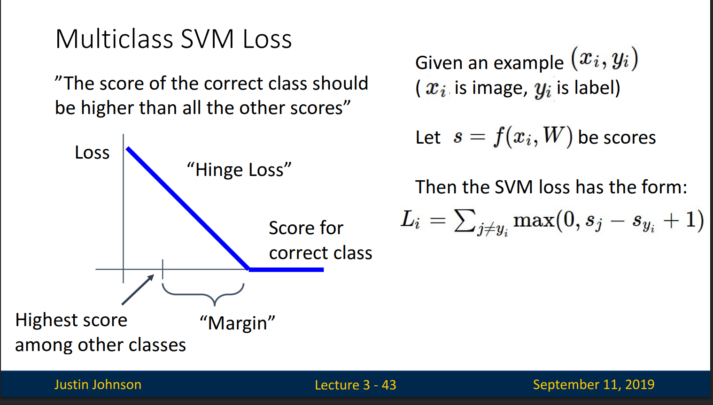
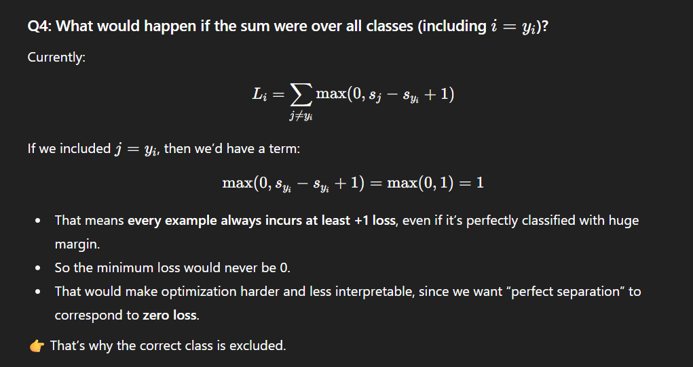
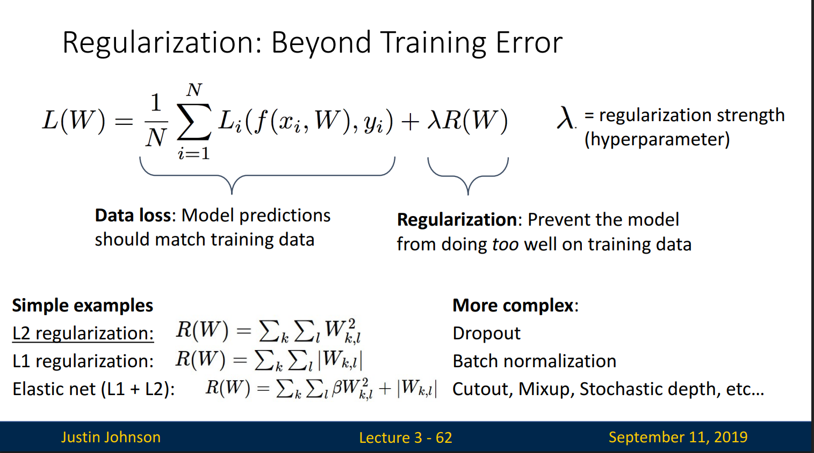
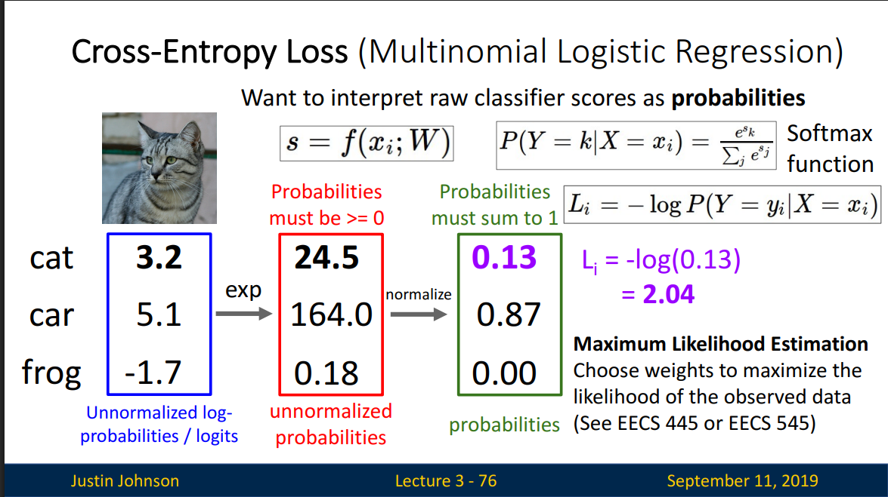
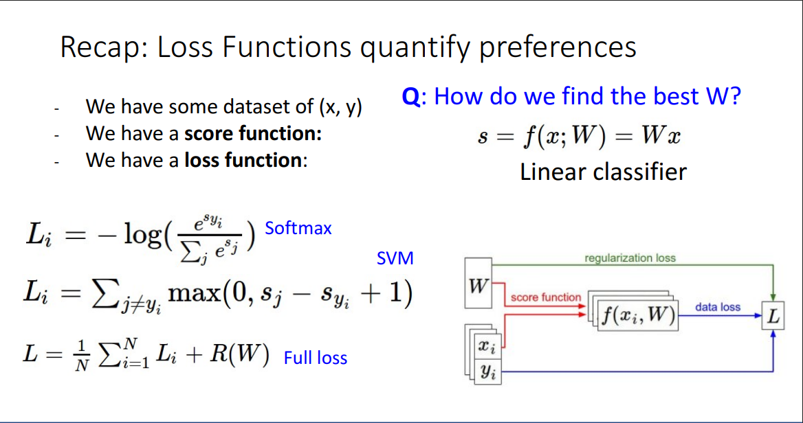

# Deep learning

Hierarchical learning algorithms with many 'layers', (very) loosely inspired by the brain


Deep learning goes mainstream with Alexnet 2012 made for the IMAGENET challenge



## Perceptron

One of the earliest algorithms that could learn from data
Implemented in hardware! Weights stored in potentiometers,
updated with electric motors during learning
Connected to a camera that used 20x20 cadmium sulfide
photocells to make a 400-pixel image
Could learn to recognize letters of the alphabet
Today we would recognize it as a linear classifier

## Backpropagation



## ML Approach



## Hyperparameters



# Linear Classifier

## Intuition (Algebraic)

A linear classifier is usually written as: f(x)=w⋅x+b

Think of the weights as sliders that tell the model how important each feature is for the decision

The bias is like the baseline threshold or offset.

Without it, the decision boundary (the line or hyperplane) would always pass through the origin (0,0,...). But real problems don’t line up neatly like that.



Algebraic Viewpoint = weights × pixels + bias → scores.

Visual Viewpoint = each class has a template; compare input against templates.

Geometric Viewpoint = classifiers create hyperplanes cutting the space into class regions.

## Choosing a good W

1. Use a loss function to quantify how good a value of W is
2. Find a W that minimizes the loss function (optimization)

## Loss Function

A loss function tells how good our current classifier is

Low loss = good classifier
High loss = bad classifier

(Also called: objective function;
cost function)

### Multi Class SVM loss

The score of the correct class should be higher than all the other scores.

The multiclass SVM loss for a single example is:

```math
L_i = \sum_{j \ne y_i} \max(0, s_j - s_{y_i} + 1)
```

Where:

- \( L_i \) is the loss for example \( i \)
- \( x_i \) is the input image
- \( y_i \) is the true label (e.g., "dog")
- \( s = f(x_i, W) \) is the vector of scores for all classes
- \( s\_{y_i} \) is the score for the correct class (\( y_i \), e.g., dog's score)
- \( s_j \) is the score for some other class \( j \)
- The sum is over all classes \( j \) not equal to the correct class \( y_i \)
- The margin (here, 1) is a hyperparameter
- The loss increases if incorrect classes have scores close to or higher than the correct class

SVM loss = make the correct class not just win, but win by a safe margin.

Formula = hinge loss: punish if wrong classes are too close.

Geometric meaning = push decision boundaries apart so classes are well separated.





# Regularization



Avoid overfitting: Prefer simple models that generalize better

### Cross-Entropy Loss (Multinomial Logistic Regression)

Want to interpret raw classifier scores as probabilities



The network outputs raw scores (logits).

Softmax turns them into probabilities.

Cross-entropy compares the predicted probability of the true class against 1.

The loss is low if the model assigns high probability to the correct class, and high otherwise.


SVM Loss (hinge) only cares about the margin — as long as the correct class is “ahead by 1,” it’s happy. After that, no incentive to push further.

Cross-Entropy Loss always keeps pushing probabilities toward 1, never truly reaching 0 loss unless the probability is exactly 1 (which is impossible in finite scores).


