# Training Neural Networks

## Activation Functions

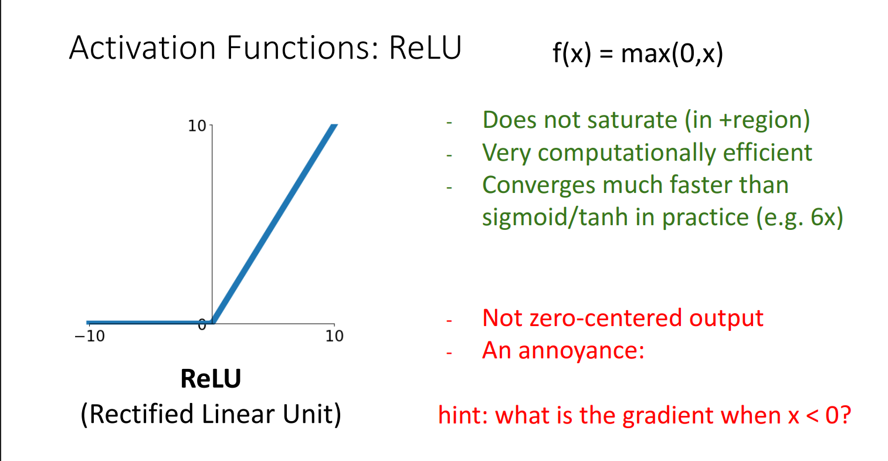

Then there are various other RELU's as mentioned in michigan slides but mostly all of them have similar accuracy on the cifar 10

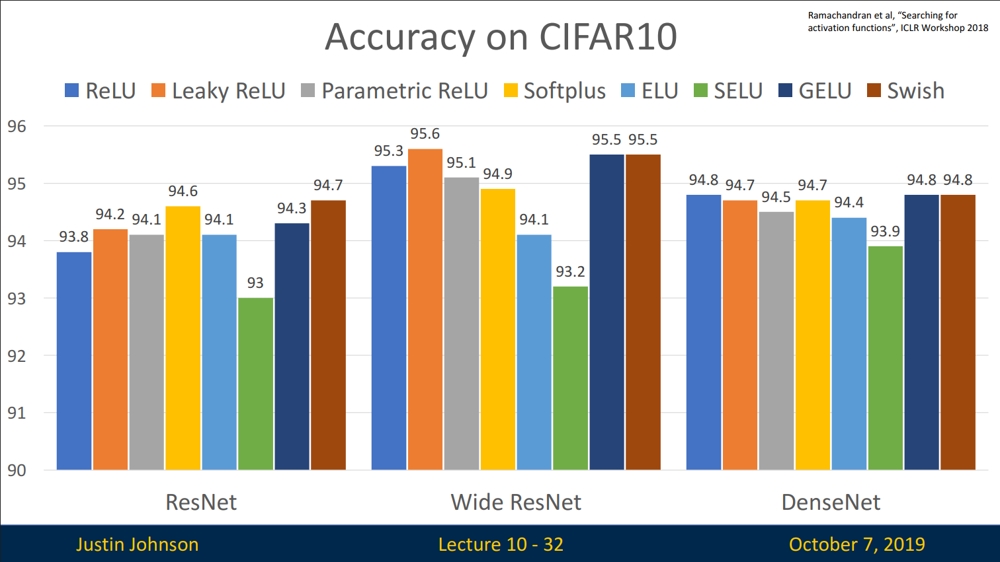

Don’t think too hard. Just use ReLU

## Data Preprocessing

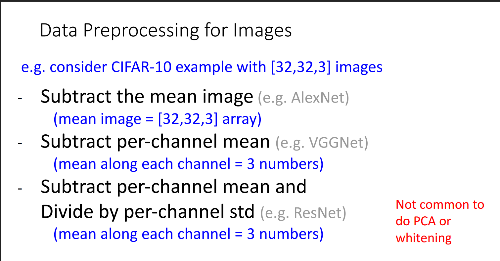

## Weight Initialization

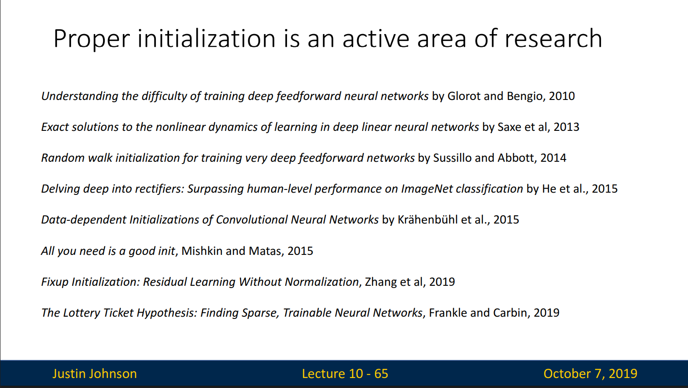

## Regularization

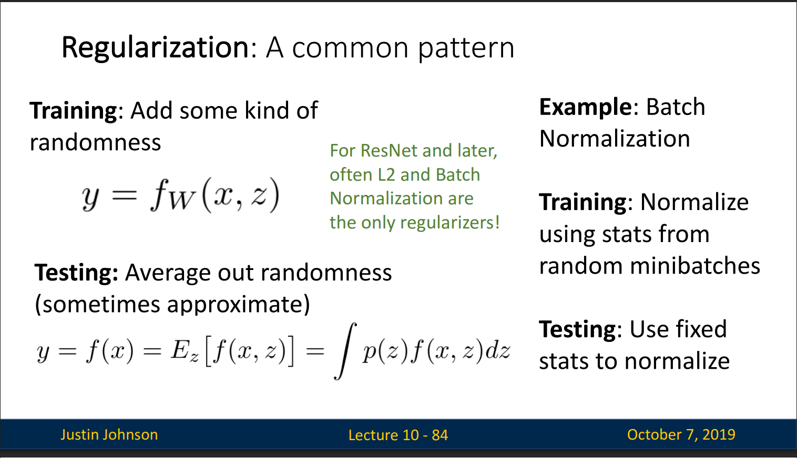

1. Dropout- In each forward pass, randomly set some neurons to zero Probability of dropping is a hyperparameter; 0.5 is common

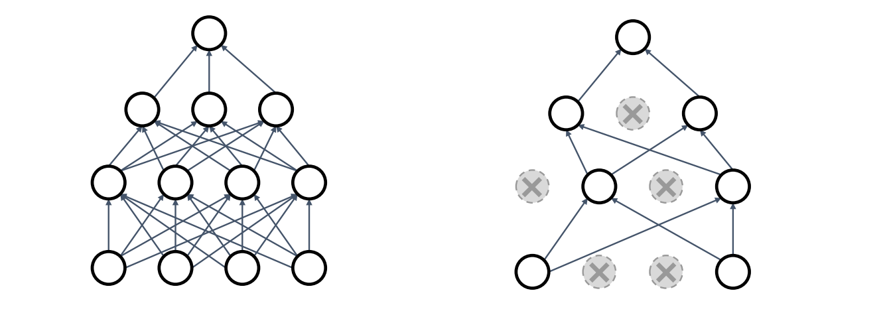

Forces the network to have a redundant representation; Prevents co-adaptation of features

At test time, drop nothing and multiply by dropout probability

Later architectures (GoogLeNet,ResNet, etc) use global average pooling instead of fully-connected layers: they don’t use dropout at all!

## Data Augmentation: Get creative for your problem!

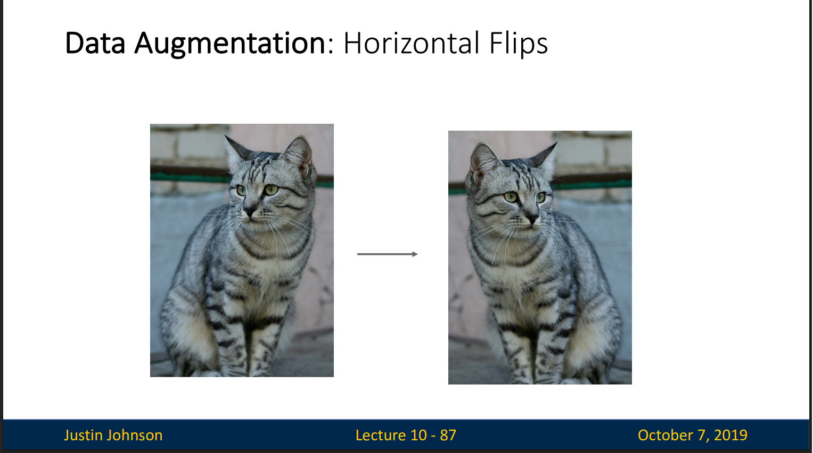

## Learning rate

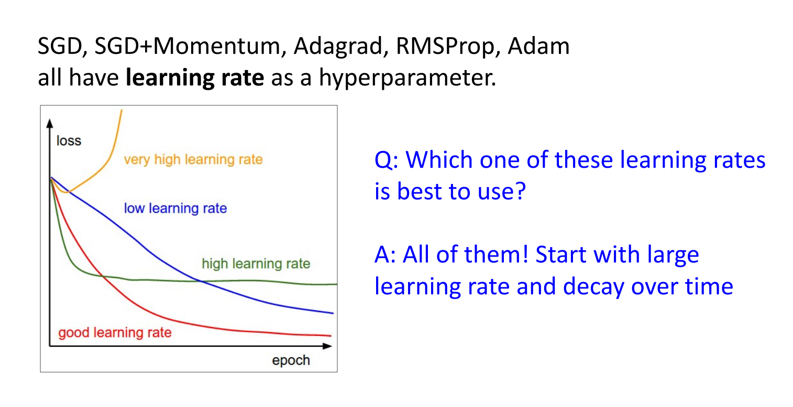

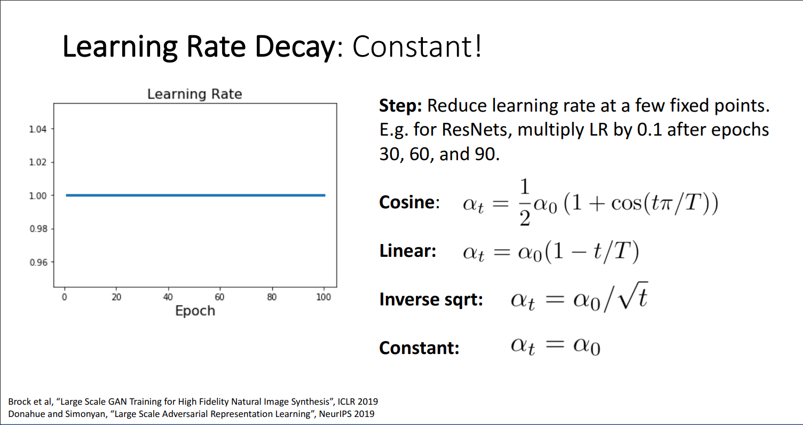

How long to train? Early Stopping

Stop training the model when accuracy on the validation set decreases
Or train for a long time, but always keep track of the model snapshot that
worked best on val. Always a good idea to do this!

## Choosing Hyperparameters

There is a lot of info on this , Grid search vs Random Search but CampusX gave Bayesian search in which we used Optuna so idk if i need to cover grid and random when Bayesian Search is better

## Transfer Learning (Very important)

Definition: Instead of training a CNN from scratch (which needs huge data + compute), we “transfer” the knowledge learned by a large pre-trained model (like ResNet, VGG, EfficientNet, etc.) to a new task.

Analogy: Imagine you learned to play cricket. Now when learning baseball, you don’t start from zero—you already know how to swing, catch, etc. That prior knowledge helps you adapt faster.

### Why Transfer Learning in CNNs?

CNNs trained on huge datasets (like ImageNet with 1.2M images, 1000 classes) learn:

Early layers → detect simple patterns (edges, corners, textures).

Middle layers → detect shapes (circles, patterns, object parts).

Later layers → detect task-specific concepts (dogs, cars, faces).

👉 These early and middle features are general, so we can reuse them for new tasks with smaller datasets.

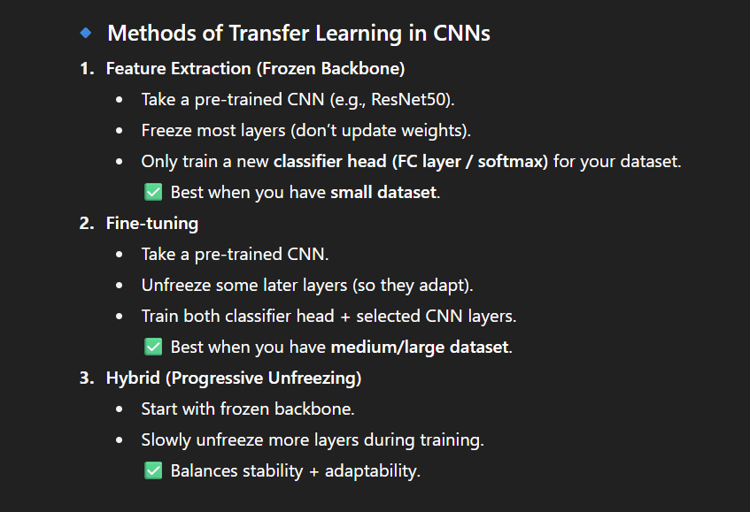

Higher Accuracy: Models like ResNet have seen millions of images—this prior knowledge helps generalize.

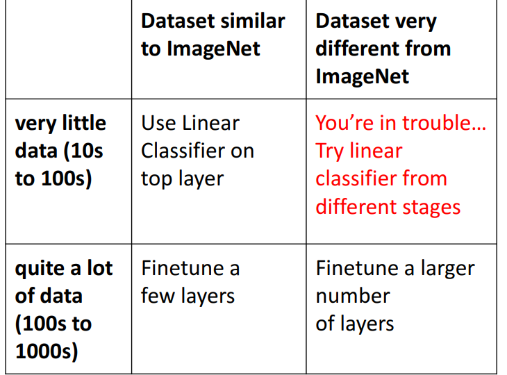

Pretraining + Finetuning beats training from scratch when dataset size is very small
