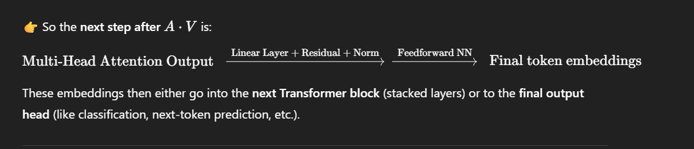

# Self-Attention (Transformer)

**Steps:**

1. Convert each input embedding into three vectors:

   - Query (Q)
   - Key (K)
   - Value (V)

2. Compute relevance scores by dot product of **Q with all K**.

3. Scale the scores by **√(dk)** (dimension of K) to keep values stable.

4. Apply **softmax** to get attention weights.

5. Multiply the weights with **V** and sum → gives the output for each token.

---

**Formula:**

**Mnemonic:** _"Q loves K, divided by √dk, softmax gives weights, multiplied with V = Output."_

