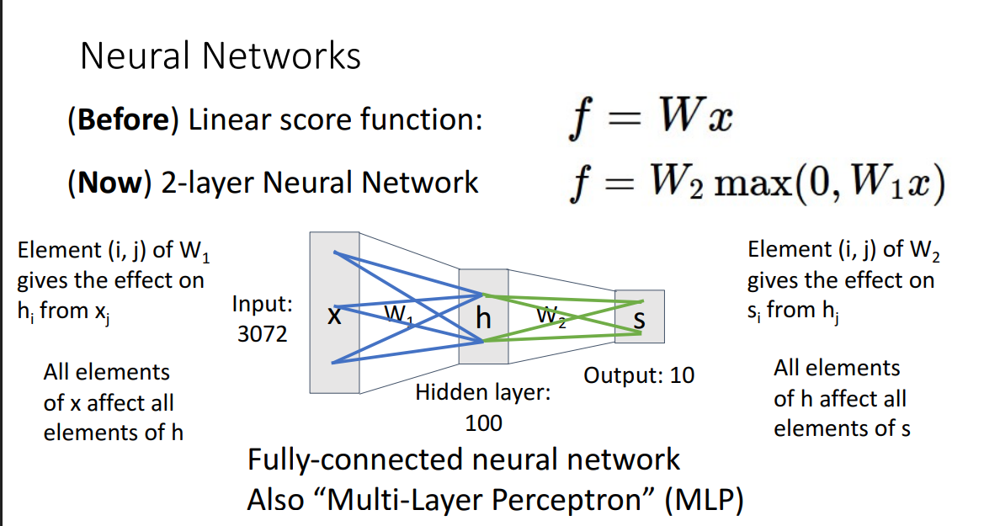
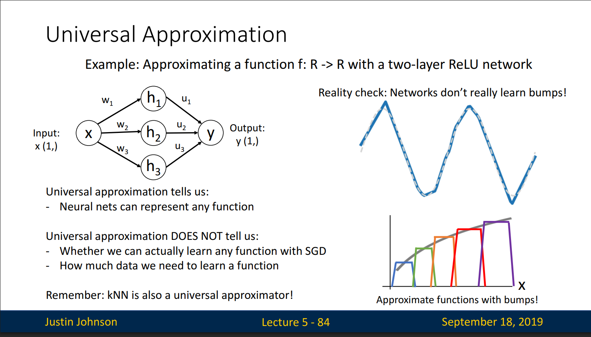
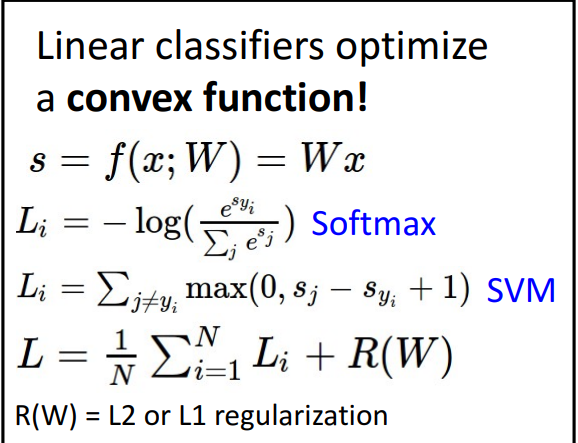

# Neural Networks

Problem: Linear Classifiers aren’t that powerful




## 2-Layer Neural Network

```
f = W₂ · max(0, W₁x)
```


### What the Layers Mean (Intuition)

**Input → Hidden (via W₁):**  
Each hidden neuron learns to detect some useful feature from the raw input.

- One neuron might detect edges.
- Another might detect a color blob.
- Another might detect a texture.

These are _feature detectors_.

**ReLU Activation:**  
Think of ReLU as a switch:

- If a feature is strongly present, the neuron "fires" (outputs a positive value).
- If not, it stays silent (outputs 0).

**Hidden → Output (via W₂):**  
Now the network combines these features to make decisions.

- "If edge + whisker + ears → maybe it’s a cat."
- "If round + dark center → maybe it’s a zero."

👉 Instead of directly mapping pixels to classes, the hidden layer first learns a useful vocabulary of features.

A 2-layer NN first reshapes the input space with hidden features (thanks to ReLU(Activation Function)), then makes the classification.

This gives nonlinear decision boundaries and much richer modeling power.


The left picture shows how hidden neurons act like little "detectors" or "sub-templates."

Instead of saying "a car looks exactly like this," the network says:
"a car could look like this OR this OR this… and if any of those patterns show up, I’ll still recognize it as a car"

### Activation Functions


Q: What happens if we build a neural network with no activation function? - we end up with linear classifier

Some more activation functions:


ReLU is a good default choice for most problems

## Space Warping

Instead of trying to draw complicated boundaries in the original space, neural networks say:

"Let’s change the space itself!"

A hidden layer applies a linear transform (ℎ=𝑊x) → rotates/stretches coordinates.

Then, a nonlinear activation (ReLU, sigmoid, tanh) warps the space by bending and folding it.

**_*A linear boundary in the warped space looks like a nonlinear boundary back in the original input space.*_**

Without nonlinearity, stacking layers is pointless → multiple linear transforms collapse to one big linear transform.

With nonlinearity, each layer can bend and fold space differently, making it progressively easier to separate the classes.


Neural networks use nonlinear activations to warp the input space so that complex, nonlinear class boundaries in the original space become simple, linear boundaries in the transformed space.

## Universal Approximation

**A neural network with one hidden layer can approximate any function f: RN -> RM with arbitrary precision**

In plain words:

Neural networks are universal function approximators.

A neural network with just one hidden layer (but lots of neurons) can represent any function you care about. Each hidden neuron contributes a small nonlinear piece, and by combining enough of them, the network can “sculpt” arbitrarily complex functions. This is why neural networks are so powerful and why we call them universal approximators.


## Convex Functions

**Intuition: A convex function is a (multidimensional) bowl**

Generally speaking, convex functions are easy to optimize: can derive theoretical guarantees about converging to global minimum



Most neural networks need nonconvex optimization:

- Few or no guarantees
  about convergence
- Empirically it seems to
  work anyway
- Active area of research
  
