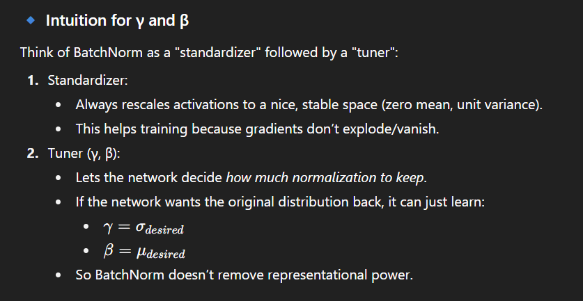

# Convolutional Neural Networks

Problem: So far our classifiers don’t respect the spatial structure of images!

Solution: Define new computational nodes that operate on images!

A fully connected layer looks at the entire image as one long list of numbers and learns weighted combinations of all pixels to decide between classes

The filter slides over the image, left-to-right and top-to-bottom.

At each location:

It computes a dot product between the filter weights and the overlapping patch of the image (size 3×5×5 = 75 numbers).

Produces 1 number (activation).

Repeat this sliding for all possible positions → builds the activation map.

Each conv layer adds depth (more filters → more feature maps).

But each layer shrinks spatial size (because no padding is used).

The filter shape always matches the depth of the input, but spatial size (3×3, 5×5, etc.) is chosen by us.

👉 It’s like each layer looks for increasingly abstract features:

First: edges, colors (6 filters).

Second: corners, textures (10 filters).

Third: object parts (12 filters).

What do convolutional filters learn?

For convolution with kernel size K, each element in the output depends on a K x K receptive field in the input

## Pooling layers

Another way to downsample

## Batch Normalization

Idea: “Normalize” the outputs of a layer so they have zero mean and unit variance

This is a differentiable function, so we can use it as an operator in our networks and backprop through it

Problem: What if zero-mean, unit variance is too hard of a constraint?

Problem: Estimates depend on minibatch; can’t do this at test-time!

Training → BN relies on minibatch stats to stabilize optimization.

Testing → BN relies on the population statistics (approximated by running averages collected during training)

